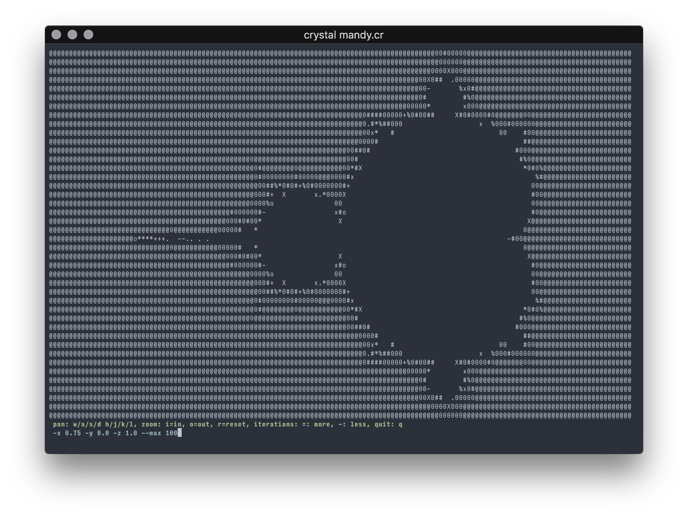

# Mandy

The little Mandelbrot set generator that could.



```sh
# Run from Docker, full terminal screen
docker run -it --rm ddrscott/mandy -r `tput lines` -c `tput cols`

# Remove the image to save 12mb.
docker image rm ddrscott/mandy
```

```sh
# center of set, 80x25 characters
crystal mandy.cr

# center full terminal

crystal mandy.cr --  -r `tput lines` -c `tput cols`

# some place
crystal mandy.cr -- -x 0.7080661034656093 -y 0.3526601235552301
```

## Usage

```sh
# crystal mandy.cr -- --help
Usage: crystal mandy.cr -- [arguments]
    -x X                             center point X
    -y Y                             center point Y
    -z ZOOM, --zoom=ZOOM             initial zoom
    --max MAX, --max=MAX             max iterations
    --fps=FPS                        max FPS
    --help                           Show this help
```

## Build It

```sh
# release build
crystal build mandy.cr --release

# run the release
./mandy

# full terminal
./mandy -r `tput lines` -c `tput cols`
```
